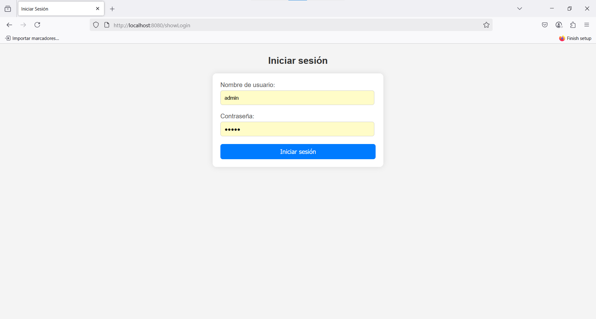
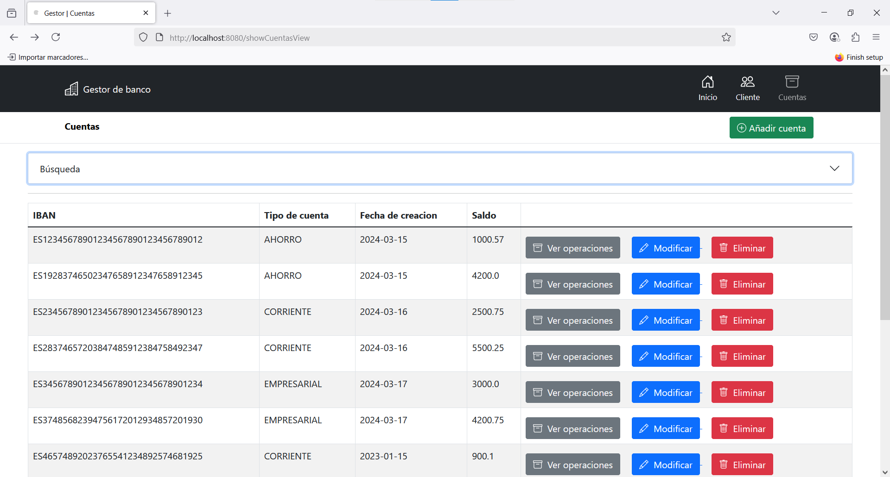

# GESTOR de Cuentas Bancarias 🏦

Aplicación web desarrollada con Spring Boot para la gestión de cuentas bancarias y operaciones asociadas, incluyendo autenticación mediante login y cifrado de IBANs. Utiliza MySQL como base de datos.

## 🚀 Características principales

- Login con autenticación de usuarios
- Gestión de cuentas bancarias:
  - Crear, modificar y eliminar cuentas
  - Ver operaciones asociadas
- Asociación de clientes a cuentas bancarias
- Cifrado de IBANs para seguridad
- Interfaz web amigable con Thymeleaf
- Control de errores personalizado
- Exportación de operaciones a CSV

## 🔧 Tecnologías utilizadas

- **Backend**: Java, Spring Boot, Spring Data JPA, Spring Security
- **Frontend**: HTML, CSS, Thymeleaf, Bootstrap
- **Base de datos**: MySQL
- **Otros**: Lombok, Apache Commons Codec

## 🖼️ Capturas de pantalla

### Inicio de sesión


### Vista de cuentas


## ⚙️ Instalación

1. Clona el repositorio:
   ```bash
   git clone https://github.com/JesusLuna2309/SpringBootCRUDLogin.git
   cd SpringBootCRUDLogin
   ```

2. Crea una base de datos en MySQL llamada `gestor_banco` (o el nombre que configures en `application.properties`).

3. Configura las credenciales de tu base de datos en el archivo `src/main/resources/application.properties`.

4. Ejecuta el proyecto desde tu IDE o con Maven:
   ```bash
   ./mvnw spring-boot:run
   ```

5. Accede a la aplicación en [http://localhost:8080](http://localhost:8080)

## 🔐 Usuario de prueba

- **Usuario**: `admin`
- **Contraseña**: `admin`

## 📂 Estructura del proyecto

```
SpringBootCRUDLogin
├── src
│   ├── main
│   │   ├── java
│   │   │   └── com.example.gestorbanco
│   │   └── resources
│   │       ├── static
│   │       ├── templates
│   │       └── application.properties
└── pom.xml
```

## 📄 Licencia

Este proyecto está licenciado bajo la MIT License.

## ✉️ Contacto

Proyecto desarrollado por **Jesús Luna Romero**  
Repositorio: [https://github.com/JesusLuna2309/SpringBootCRUDLogin](https://github.com/JesusLuna2309/SpringBootCRUDLogin)
